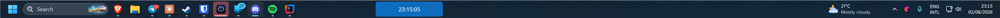
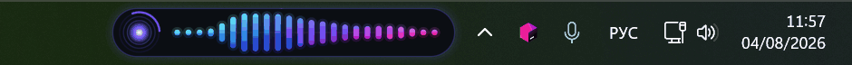
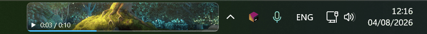
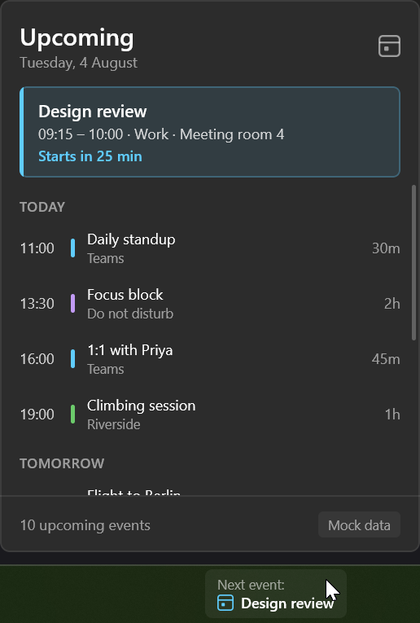
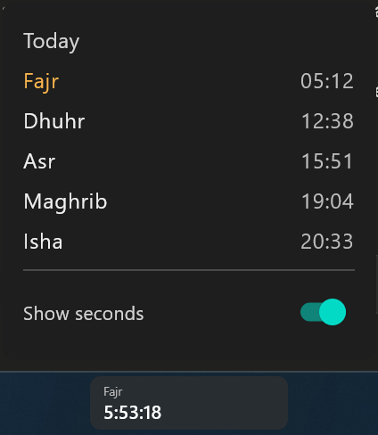
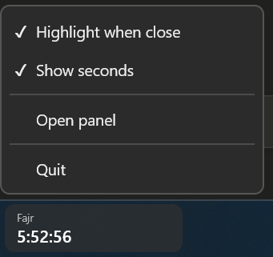

# Compose for Windows TaskBar

[](https://central.sonatype.com/artifact/uk.kulikov/compose-windows-taskbar)
[](https://github.com/LionZXY/ComposeWindowsTaskBar/actions/workflows/ci.yml)
[](https://kotlinlang.org)
[](https://www.jetbrains.com/lp/compose-multiplatform/)
[](#how-it-works)
[](LICENSE)

Put Compose for Desktop content **inside the Windows taskbar**. Not the tray — the taskbar itself.



## Install

```kotlin
dependencies {
    implementation("uk.kulikov:compose-windows-taskbar:0.1.0")
}
```

Native bindings ship with it — JNA's stubs arrive transitively, nothing to build or unpack.

## Use

```kotlin
fun main() = application {
    WindowsTaskBar {
        Text("Hello, taskbar")
    }
}
```

It behaves like Compose's own `Window` / `Tray`: declarative, recomposes live, and keeps
`application { }` alive while composed. On non-Windows it composes nothing and reports
`TaskBarError.UnsupportedOs` — multiplatform apps keep building.

## Examples





## Options

| Parameter | Default | What it does |
|---|---|---|
| `visible` | `true` | Show/hide without tearing the widget down |
| `size` | `180.dp × taskbar height` | Unspecified height = as tall as the taskbar |
| `alignment` | `BeforeTray` | `Start`, `AfterStart`, `AfterTaskList`, `Center`, `BeforeTray`, `End`, `Absolute(dp)` |
| `targets` | `Primary` | `Primary`, `All`, `Secondary`, `Monitor(deviceName)` — one instance per taskbar |
| `movable` | `true` | Drag along the taskbar; offset lands in `TaskBarState.offset` |
| `clickable` / `clickThrough` | `true` / `false` | Make the widget inert (`WS_EX_TRANSPARENT`) |
| `injectionMode` | `Auto` | `Reparent`, or `Overlay` as a fallback |
| `onClick` / `onRightClick` | `null` | Fire for clicks the content did not consume |
| `contextMenu` | `null` | `item` / `checkbox` / `separator` / `submenu` DSL |
| `onStatusChanged` | `{}` | Observe injection, `explorer.exe` restarts, failures |

Content is clipped to the taskbar, so anything bigger goes in a `Flyout` — a borderless window
anchored just off the taskbar, which *can* take focus and dismisses itself on click-away.

 

## How it works

Windows has no API for this. Deskbands (`IDeskBand`) were removed in Windows 11, so — like every
current taskbar-widget project — this creates a borderless, transparent Compose window and makes it
a `WS_CHILD` of `Shell_TrayWnd` via `SetParent`. It then reconciles against the live taskbar
geometry a few times a second, so it survives `explorer.exe` restarts, taskbar moves, DPI changes
and display changes.

Run `TaskBarDiagnostics.report()` to see exactly what the library sees.

## Samples

Separate Gradle build that consumes the published artifact — `./gradlew publishToMavenLocal`, then
`./gradlew -p samples :hello-taskbar:run`.

| Sample | Shows |
|---|---|
| `hello-taskbar` | The ten-line version |
| `system-monitor` | `clickThrough`, `Start` alignment, coexisting with `Tray` |
| `media-controls` | `movable`, transport buttons, scrubber flyout |
| `prayer-countdown` | Countdown + settings panel (an Awqat-Salaat-style widget) |
| `multi-monitor-clock` | `targets = All`, consumed from a KMP build |
| `playground` | Every option wired to a control |
